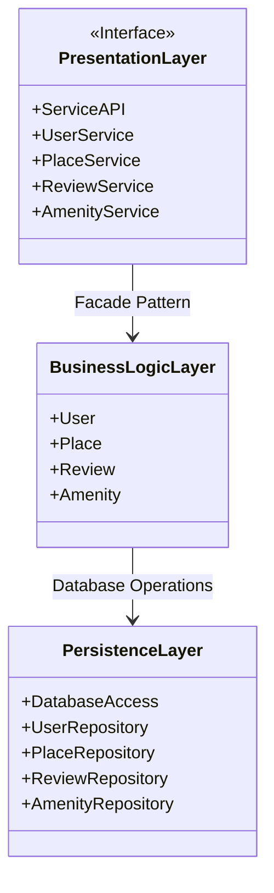
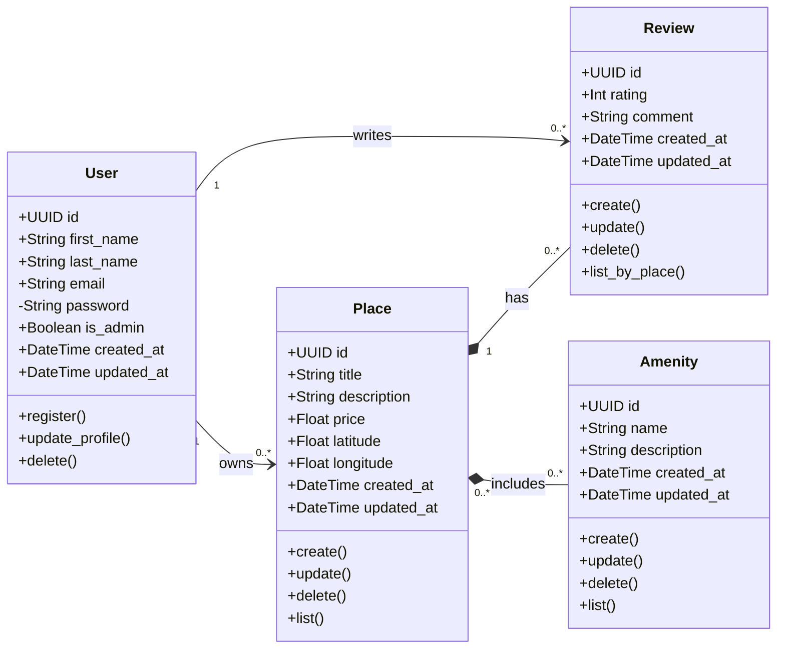
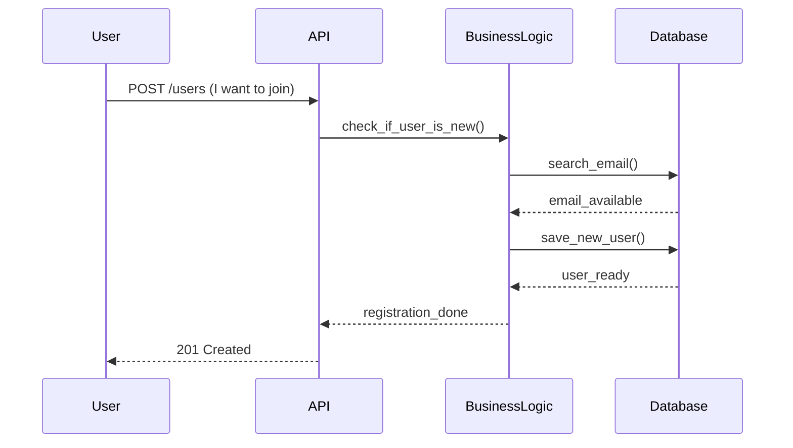
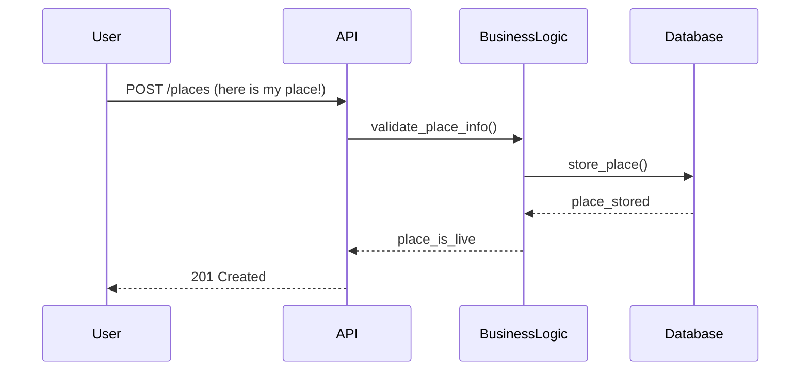
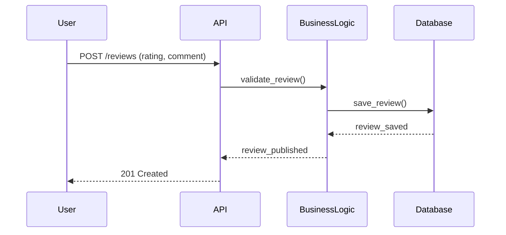
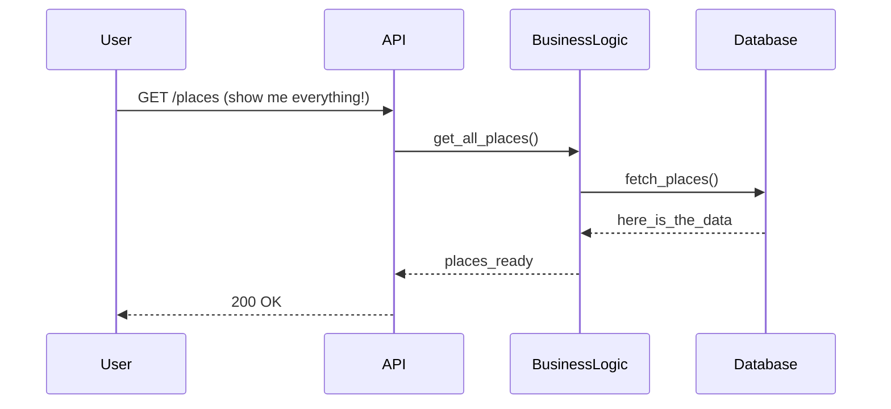

# HBnB Evolution - Technical Documentation

## Introduction
This document serves as the technical blueprint 
for the HBnB Evolution application, a simplified 
AirBnB-like platform. It includes the architecture 
design, business logic, and API interaction flows 
that will guide the implementation phases.

---

## 1. High-Level Architecture

### Overview
The application follows a three-layer architecture
communicating via the Facade Pattern.

### Diagram

### Explanation
- *Presentation Layer:* Handles user interaction via services and APIs.
- *Business Logic Layer:* Contains core models and business rules.
- *Persistence Layer:* Manages data storage and retrieval.
- *Facade Pattern:* Simplifies communication between layers.

---

## 2. Business Logic Layer

### Overview
Contains the four core entities of the application.

### Diagram

### Explanation
- *User:* Application user, can be regular or admin.
- *Place:* Property listed by a user, includes location and price.
- *Review:* Review left by a user for a place.
- *Amenity:* Feature associated with a place.

---

## 3. API Interaction Flow

### 3.1 User Registration

### 3.2 Place Creation

### 3.3 Review Submission

### 3.4 Fetching a List of Places

